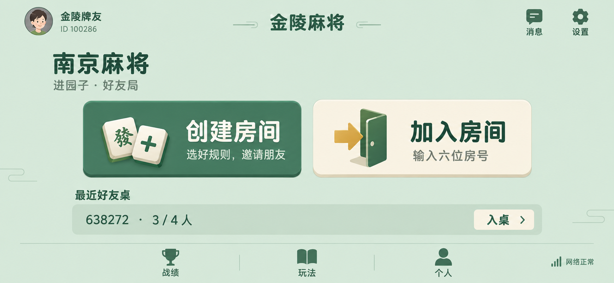

# 大厅方向稿 v2

状态：ImageGen 视觉讨论稿，不是可运行 Cocos 界面。牌桌设计、资源和业务代码不变。未提交或 push。

## 参考边界

查看了微乐四川麻将公开攻略中的两版大厅、建房设置截图。攻略标注 2024-11-29；不代表当前微信小程序最新版本，也未实际登录小程序。

- https://shouyou.3dmgame.com/gl/538167.html
- https://shouyou.3dmgame.com/gl/538370.html

借鉴操作结构：身份与工具靠边、房间动作突出、短标签、紧凑规则选项。不复制品牌、美术和营销功能。

## 本稿



放弃上一版品牌海报式左右分栏、巨大宋体标题与摆拍主视觉。仅展示创建/加入与辅助入口。图中账号、房号为示例；消息入口是否独立、最近好友桌的数据源需在产品审计中确认，不视为已实现功能。创建入口仍须遵循现有账号权限，未修改服务端开桌权限。

生成图尚有需在组件实现中清理的细节：装饰线不作为组件资产保留；控件字号、圆角、边线与渐变统一按最终 Token 重新制作。不要把整张位图当可点击的正式 UI。

## 生成记录

使用内置 image_gen（非 CLI）。无参考图文件输入；根据已查看的公开截图整理结构约束。完整提示词如下。

```text
Use case: ui-mockup
Asset type: Jinling Mahjong lobby revision 2, ONE landscape phone game lobby screenshot, 2.16:1 wide, fully opaque.
Primary request: A practical shipped Chinese social mahjong mini-game style lobby, informed by the interaction hierarchy of Weile regional mahjong mini-games: small player identity at upper left, compact room actions, useful edge utilities, short labels, clear touch targets, an integrated game canvas. ORIGINAL design for 金陵麻将, not a clone of Weile's branding or assets. This is a FRIENDS ROOM GAME, not a website, editorial cover, luxury brochure, dashboard, or a redesign of the playing table.
The previous rejected design used an enormous serif 南京麻将 title, green/cream split-screen, slogan, photorealistic still-life mahjong hero and web-style room table. COMPLETELY ABANDON those patterns. No left brand hero, no split-screen, no giant calligraphy, no slogans, no staged tile photo, no gratuitous empty poster space.
Screen composition: compact safe-area aligned header height 15%: upper left modest 44px avatar with nickname '金陵牌友' and small 'ID 100286', modest centered wordmark '金陵麻将' rendered clean, not ornamental. Upper right two small same-size game utility icons with labels '消息' and '设置'. Main play selection area occupies central 65% of screen, all presented over ONE continuous desaturated soft jade background. Short left-aligned section heading '南京麻将' with small subtitle '进园子 · 好友局'. Immediately below are TWO functional, broad low-profile ROOM ACTION BUTTONS centered horizontally, same dimensions, width about 31% of screen each, height about 25% of screen, aligned side by side with small gap. These are immediately tappable game controls, not dashboard cards. First button muted mid jade solid body with warm white bold rounded Chinese label '创建房间', smaller sublabel '选好规则，邀请朋友'; second warm ivory solid body with dark ink-green bold rounded Chinese label '加入房间', smaller sublabel '输入六位房号'. Each button uses one small crisp hand-painted 2.5D GAME UI emblem occupying at most a quarter of the button: first two ivory mahjong tiles with a plus sign, second a simple open door with an entering arrow. Tile emblems are miniature functional game icons, not floating 3D hero illustrations. Buttons have consistent restrained 10px corner radius and a shallow darker 2px lower edge for press affordance, NO glow, shiny bevel, noisy texture or broad drop shadow. Labels visually dominate icons.
Below the two actions a SINGLE compact room continuation strip, no outer card: small label '最近好友桌', then one line '638272  ·  3 / 4 人' and right-aligned short tappable '入桌'. No data table headers or charts. Bottom utility dock ~12% height contains exactly three quiet equal-size filled-pictogram + label controls '战绩', '玩法', '个人'; bottom right tiny signal icon and '网络正常'. Fixed clear grid, essential text comfortably readable on a 932x430 phone, no scattered mismatched button sizes.
Art direction: approachable professional regional mini-game, modest warmth, soft clean game illustration finish in functional icons only, not austere banking software and not hyperactive casino. Continuous muted pale jade #DCE9DD main canvas, deeper green #386953 for main action and UI type, warm cream #F8F3E6, very small restrained ochre accents only. Background is FLAT with at most faint abstract horizontal linework near far corners, NOT landscape scenery, forest, buildings, pagoda, water scene, particles, glass, vignette or full-screen gradient. Chinese interface type is clear contemporary rounded Hei/sans, consistent weights and sizes, no exaggerated tracking. The only small natural shadow is inside hand-painted tile icons. No monetization, currencies, shop, rewards, badges, gambling, cartoon hostess, red notification dots, English, luxury gold trim, card grids or decorative filler. No device frame, callouts, presentation headings or outside canvas.
Text exactly as specified in Simplified Chinese. Output ONLY the lobby, NOT a mahjong playing board.
```
