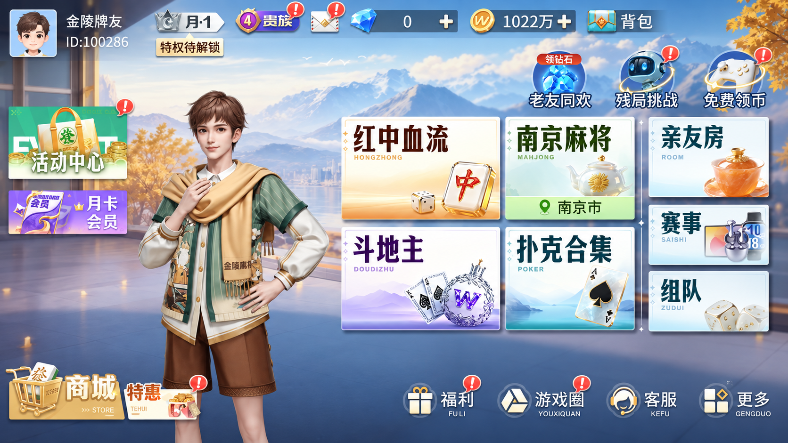

# 大厅实机对照稿 v3

## 交付状态

这是根据用户已打开的微信「微乐家乡麻将」右侧游戏画面制作的高还原视觉讨论稿，不是可运行客户端，也不声称逐像素相同。

用户最新指示覆盖此前低饱和/极简方向：采用实机中的鲜艳色彩、人物场景、立体道具和入口布局。牌桌暂不修改。



## 范围

- 排除微信左侧福利面板与顶部桌面容器。
- 对照原截图保留四大入口、右侧三小入口、顶部状态、左侧推广与底部工具的构图。
- 原账户头像和 ID 不复用；替换为示例头像、金陵牌友、ID:100286。
- 图中商城、其他游戏、货币、福利等为参照画面中的视觉占位，未开发、未接入，也没有修改开桌权限或支付能力。
- 图像仅作为设计研究材料。不能用整图覆盖 App 假装完成 Cocos 迁移；正式实现需组件化、状态化，并确认产品入口和美术资产使用范围。
- 未修改业务代码、牌桌、规则；未提交或 push。

## 生成与核查

方式：内置 image_gen，使用最近一张用户授权查看的微信小程序窗口截图作为编辑参考（num_last_images_to_include:1），没有使用 CLI。

核查：已目视检查输出；蓝色场景、人物站位、右侧 2×2+3 布局与鲜艳入口色彩均保留；未包含微信面板。生成图仍存在与参考的细节差异，不作为像素级验收结果。

## 完整提示词

```text
Use case: ui-mockup
Input image: the most recent screenshot in this conversation is the user's live WeChat window showing 微乐家乡麻将. It is the exact visual reference and edit target. Use THIS screenshot, not any of the earlier generated mint-green mockups.
Primary request: Produce a high-fidelity visual reproduction of ONLY THE GAME CANVAS on the RIGHT of the screenshot, as a clean edge-to-edge 16:9 landscape game lobby. Precisely retain its composition, rich saturated commercial mobile-game rendering, button geometry and relative positions. Do not redesign or simplify. The user explicitly requests the same look, not a minimalist reinterpretation.
Crop/exclusion: discard the entire white WeChat welfare sidebar occupying the left third, and discard the white desktop/WeChat title bar at the top. The game region starts near screenshot pixel x=828,y=88 and ends at x=2450,y=1000. Expand this exact region to fill the output. No phone frame, desktop chrome, white margins, annotations, comparison panels or playing table.
Preserve the game scene: luminous blue sky and distant mountains seen from a broad modern terrace, lake/city backdrop, warm autumn-yellow trees, cool slate-blue stone foreground, soft warm natural daylight; detailed polished game background. Keep the youthful male lobby guide standing on the LEFT-center of the game canvas, brown hair, green striped shirt, yellow scarf over shoulders, cream sleeves, brown shorts, same pose and scale. No newly invented additional characters.
Preserve all UI geometry and visual treatment from the reference. Top bar holds small avatar/name area on the left, silver rank badge, purple status badge, envelope icon, faceted blue gem meter and gold coin meter, backpack on right. Left edge two stacked small vivid promotional tiles: green-orange '活动中心', purple '月卡会员'. Three small shiny function icons above the main mode grid on right: '老友同欢', '残局挑战', '免费领币'.
Main mode grid is on the RIGHT, about 55% of the canvas width, and follows the exact reference arrangement: four large near-white rectangular tiles in a 2-by-2 block and three smaller tiles stacked vertically at the far right. Thin bright edges, shallow crisp bevels, soft grounded shadows, strong black/dark colored bold Chinese titles top-left, jewel-like 3D props lower-right, softly colored lower bands and fine material highlights.
Upper-left large tile warm orange with title '红中血流', a glossy gold-edged red-center mahjong tile and small dice. Upper-middle large tile fresh green with title '南京麻将', glass teapot with yellow flower, and bottom location band '南京市'. Lower-left large tile lilac with title '斗地主', silver violet crown and playing cards. Lower-middle large tile cyan with title '扑克合集', ace of spades and silver decorative card motif. Right column: '亲友房' with amber glass tea bowl; '赛事' with small trophy; '组队' with white dice. Match the screenshot's tile sizes, spacing, serif-like heavy game title lettering, jewel/porcelain/glass props and color contrasts. Do NOT convert them into plain rounded web buttons.
Bottom-left gold shopping cart/商城 and compact 特惠 tile, bottom-right a row of '福利', '游戏圈', '客服', '更多' with polished dimensional icons. Keep the reference's commercially vivid blue, orange, fresh green, violet and gold palette. Do not make the result uniformly sage green, beige, washed-out, flat or editorial.
Only branding/privacy modifications: replace identifying personal photo with an anonymous game avatar, replace nickname with '金陵牌友', user ID with 'ID:100286'; replace any visible 微乐/WEILE/WLG brand marks with 金陵麻将 or a simple unbranded motif. Keep all other reference text and graphic hierarchy where legible. These extra modes and store entries are visual mockup placeholders, not implemented functionality.
Quality: sharp Chinese text, high-fidelity clean game screenshot, entirely opaque image, faithful perspective and placement, detailed polished commercial game artwork. Do not include any part of a mahjong playing-table redesign.
```
