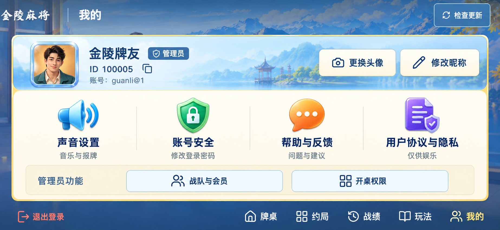

# “我的”个人页重设计 v2

状态：视觉方案，尚未替换运行中的网页。使用内置 image_gen，根据当前个人页截图编辑；没有使用 CLI。牌桌、权限、账号逻辑和微信均未改动。

## 布局

- 顶部：横向账号信息带，头像、昵称、ID、账号与编辑入口放在同一行。
- 中部：声音设置、账号安全、帮助与反馈、用户协议与隐私四个入口共用面板，不再使用纵向列表和左侧高名片。
- 底部：独立管理员功能栏；普通成员版本不渲染此栏，不改变权限。
- 退出登录与正常设置操作分离。检查更新、主导航保留。



图中的昵称和账号为本地演示数据。头像与彩色图标在正式组件化实现时需作为独立资源，不能把这张整图当作可运行界面。正式实现仍需验证568×320、932×430、安全区、长昵称与普通成员状态。

## 输入

当前个人页截图：test-results/game-ui/profile-932.png，作为编辑目标和功能清单依据。

## 完整提示词

```text
Use case: ui-mockup
Asset type: redesigned "我的" profile page for the existing 金陵麻将 landscape mobile game.
Input image role: EDIT TARGET and authoritative reference for existing features, background, brand and navigation. Redesign the PROFILE CONTENT layout substantially, not just its colors. Do not redesign the game lobby or playing table.
Primary request: A professional, colorful Chinese regional mahjong mobile-game personal center that matches the approved lively commercial-game visual language. Output ONE edge-to-edge landscape UI screenshot at approximately 2.17:1 aspect ratio, opaque. Not a web dashboard, not a presentation board, no phone mockup.
Preserve: recognizable blue lake/mountain game backdrop, compact top branding 金陵麻将 and page title 我的, upper-right 检查更新 control, bottom existing five navigation labels exactly 牌桌 / 约局 / 战绩 / 玩法 / 我的 with 我的 selected. No game currencies, fake statistics, invented VIP, level, medals, store, rewards, tasks or new functionality.
CHANGE layout: remove the existing tall left identity card and separate right stacked-list/management-card arrangement. Replace with ONE well-composed integrated game panel taking about 90% width and the middle 72% height, entirely above bottom navigation.
The top part of this integrated panel is a horizontal PLAYER IDENTITY STRIP, about a third of panel height: avatar on the left with a modest dimensional ice-blue frame, beside it nickname 金陵牌友 and a small plain 管理员 role badge, beneath compact 'ID 100005' with copy glyph and '账号：guanli@1'. On the right of this identity strip, two same-height quiet ivory buttons 更换头像 and 修改昵称, aligned horizontally. No giant centered portrait, no empty vertical identity-column space.
The lower part of the panel is an open shared warm ivory functional surface. Arrange exactly FOUR primary personal-setting entries in ONE HORIZONTAL ROW of equally spaced ICON-AND-LABEL CONTROLS, not four independently outlined cards. Each has a polished small dimensional mobile-game pictogram above a strong clear Chinese label: cyan/blue speaker 声音设置, green shield 账号安全, orange speech bubble 帮助与反馈, violet document 用户协议与隐私. Icons are medium-size 40-50 logical px, detailed game UI art but with clean recognizable silhouettes. Each entry includes a single short smaller descriptor below: 音乐与报牌, 修改登录密码, 问题与建议, 仅供娱乐. No chevrons after every line. Use negative space and subtle vertical separators, no nested card piles.
Under the four entries, an ADMIN TOOLS RAIL integrated into the same panel, visually quieter, caption 管理员功能 followed by two compact equal-sized controls 战队与会员 and 开桌权限. This is conditional admin UI, not a prestige feature. Lower-left outside/at the edge of the panel a restrained red text button 退出登录, clearly separate from normal actions. All original functional entries must be present and readable. Do not add an extra '保存' or arbitrary action.
Style: bright commercial mobile-game UI craftsmanship: sky-blue title strip, ivory surfaces, moderately saturated functional icons, clear blue text, subtle cream/gold material edge and shallow press affordance. One consistent small corner radius. Keep the original game's bright visual character, but do not add particles, lens flares, oversized shiny frames, glowing containers or ornamental scrolls. Crisp legible Simplified Chinese, relatively short copy, comfortable minimum tap-target height 44 logical px at 932x430. Content should feel like a game personal center rather than a settings form or poster. Use a cohesive bold Chinese sans-serif family for controls and a small original-style wordmark only. No title-sized slogans. Keep entire layout within safe margins.
```
