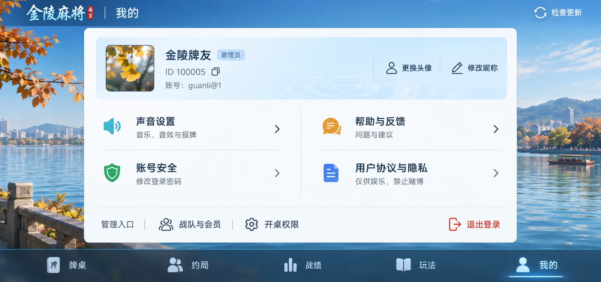

# 我的：主题方向 v3

内置 image_gen 生成的新视觉讨论稿，尚未作为整图替换网页。前一版 profile-v2 已被用户否定，不采用。



这一版探索湖蓝、瓷白、横向账号信息与两列功能行。只含现有功能，普通成员不显示管理入口。牌桌和账号逻辑不变。

完整提示词：

```text
Use case: ui-mockup
Asset type: ONE production-quality landscape mobile game screen, the “我的” personal center of 金陵麻将. 2.17:1 horizontal, opaque edge-to-edge screen, no device frame or presentation annotations.

Design a genuinely appealing, mature CHINESE MAHJONG GAME personal center. Match a lively, well-made regional mobile game rather than a generic website or office dashboard. Theme: Nanjing friends' mahjong, luminous lake-blue, porcelain white, tiny celadon and warm amber accents. Clear visual hierarchy and restrained craftsmanship, not a luxury template.

Composition:
A slim top bar: small 金陵麻将 wordmark at far left, page title 我的 beside it, 检查更新 at far right. Narrow bottom navigation with 牌桌, 约局, 战绩, 玩法, 我的; 我的 selected.
Between them ONE integrated personal-center surface, clean porcelain white, approximately 88% screen width and 70% height. Its silhouette is almost square-cornered with a small 6px radius, no gold frame. Let the river-blue game background breathe around the surface. Background is a softly illustrated Nanjing waterfront with low distant hills and autumn trees, modest detail and light; NO alpine snow peaks, pagodas, lanterns, giant characters or slogans.
At the TOP of the surface a compact horizontal account header, approximately 88 logical px high on a 932×430 display: a refined small square avatar at left, beside it 金陵牌友 with a tiny ordinary 管理员 tag; below ID 100005 with small copy icon, and 账号：guanli@1. To the right two unobtrusive text-with-small-icon controls 更换头像 and 修改昵称. The account header has a very light lake-blue tint and a subtle water-ripple material edge; no scenic picture inside it.
Below this header, make TWO CLEAR SERVICE COLUMNS with a generous gutter, NOT a grid of individual floating cards. Left column contains two wide, simple clickable rows: 声音设置 with subtext 音乐、音效与报牌, then 账号安全 with subtext 修改登录密码. Right column contains 帮助与反馈 with subtext 问题与建议, then 用户协议与隐私 with subtext 仅供娱乐，禁止赌博. Each row: small 22px refined two-tone icon, left-aligned readable 18px label and 12px subtext, quiet right-pointing chevron. Each column is a single unboxed list; fine cool-gray divider between its two rows only. Icons have subtle enamel-like color and crisp drawn outlines, never fat glossy 3D toys. A tiny cyan speaker, celadon shield, amber conversation symbol, and periwinkle document are sufficient. Rows comfortably tappable without oversized blocks.
Along the BOTTOM of the same surface a quiet ADMINISTRATOR RAIL, visually integrated by one fine divider. Label 管理入口 at left, compact controls 战队与会员 and 开桌权限 beside it. At the opposite far right a subdued brick-red 退出登录 text button. No enclosing extra rounded card around this rail.

Art and typography:
The blue background and pearl-white surfaces should feel like a polished commercial mahjong game, clear daylight, depth created only by one gentle panel shadow and restrained material edges. Saturated azure accents for interaction but calm readable content. Fonts must be clear modern Chinese sans, a small title can have regional-game personality. Crisp letter spacing, no giant thick black type, no entire-screen centered copy. Thin edges, tidy alignment, careful whitespace. Existing functionality only; no coins, VIP, levels, badges, fake statistics, rewards, shop, new features or banners.
Avoid especially the previous failed mockup aesthetics: thick cream-yellow borders, large gold frames, four gigantic plastic icons, oversized rounded rectangles, panel-inside-panel framing, sticky-note colors, pale green AI dashboard, and a web landing-page hero.
Accurate Simplified Chinese text. The result should look ready for a real horizontal phone game, not a Figma marketing cover.
```
